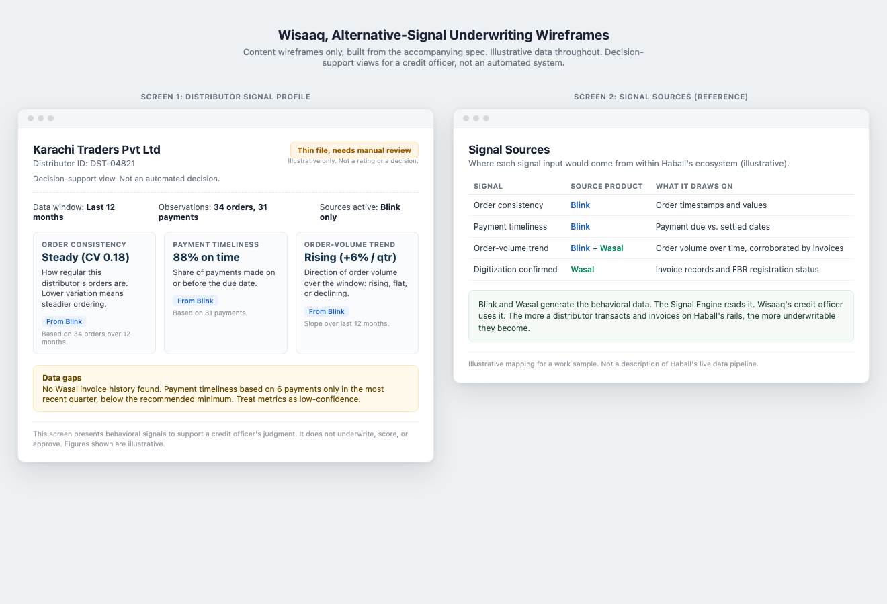

# Haball Product Associate Portfolio Piece
### by Muhammad Osama Sohail

I built this as a work sample. It shows how I take a real, researched problem in Haball's space and turn it into product documentation: a BRD, an SRS, user stories, a process flow, wireframe specs, market research, a backlog, and a small prototype. The problem I picked is Wisaaq's underwriting challenge. Most of the distributors Wisaaq is built to finance have no formal credit file, so conventional credit scoring does not have anything to work with. The one insight the whole thing is organized around is that Blink and Wasal already generate the data, order and payment behavior and invoice history, that would make Wisaaq's underwriting problem more tractable. That is the flywheel: the more a distributor transacts on Haball's rails, the more underwritable they become.

To be clear about what this is not: it is not a proposal for what Haball should build. The team has certainly thought about this more deeply than I can from outside, with data and constraints I cannot see. Where I describe Haball's internal systems, I am making assumptions and saying so. The prototype that comes with these documents is deliberately simple. It is rules-based arithmetic that visualizes signal inputs for a hypothetical credit officer. It is not a trained model, it makes no accuracy claim, and it does not predict defaults or approve anyone. It shows requirements thinking, not a credit engine.

---

## Alternative-Signal Underwriting Inputs for Wisaaq

**The problem.** Wisaaq needs to underwrite distributors who, by design, have no credit-bureau file. Roughly 90% of Pakistani retailers and distributors have zero formal digital transaction history, and traditional lenders leave about 94% of SMEs without formal credit access. Conventional credit scoring cannot work here because the underlying data was never generated.

**The insight.** Haball's own ecosystem already produces alternative signals once a distributor is on its rails: Blink (the corporate payment gateway) generates order-frequency and payment-timeliness events, and Wasal (the e-invoicing and FBR compliance product) generates invoice history once a distributor digitizes. Blink and Wasal may be the data-generation engine that makes Wisaaq underwritable for distributors who have no bureau file.

**What I built.** A full documentation set covering every part of the actual job description (BRD, SRS, user stories, process flows, wireframes, backlog, market research, stakeholder open questions), plus a Streamlit prototype that computes three plain, rules-based signals from mock distributor data and displays them as decision support for a credit officer. No trained model, no default prediction, no automated decision.



**Live demo:** not yet deployed. Run locally with the steps below, or deploy to Streamlit Community Cloud (share.streamlit.io) and drop the link here.

**Deliverables**
- [BRD](underwriting-signals/BRD_underwriting_signals.md)
- [SRS](underwriting-signals/SRS_underwriting_signals.md)
- [User Stories](underwriting-signals/user_stories.md)
- [Process Flow](underwriting-signals/process_flow.md)
- [Wireframe Spec](underwriting-signals/wireframe_spec.md) and [Wireframes (HTML)](underwriting-signals/wireframes/signal_profile_screens.html)
- [Market Research Summary](underwriting-signals/market_research.md)
- [Backlog Snippet](underwriting-signals/backlog.md)
- [Stakeholder Open Questions](underwriting-signals/stakeholder_notes.md)
- [Prototype](underwriting-signals/prototype/)

---

## Running the Prototype Locally

```bash
# 1. Clone the repo
git clone https://github.com/muhammadosamasohail/haball-pm-portfolio.git
cd haball-pm-portfolio

# 2. Install dependencies
pip install -r underwriting-signals/prototype/requirements.txt

# 3. Run the app
streamlit run underwriting-signals/prototype/app.py
```

Opens at `http://localhost:8501`. Pick a mock distributor from the sidebar to see its signal profile.

---

## Stack
Python · Streamlit · plain rules-based arithmetic (no ML libraries, by design)
